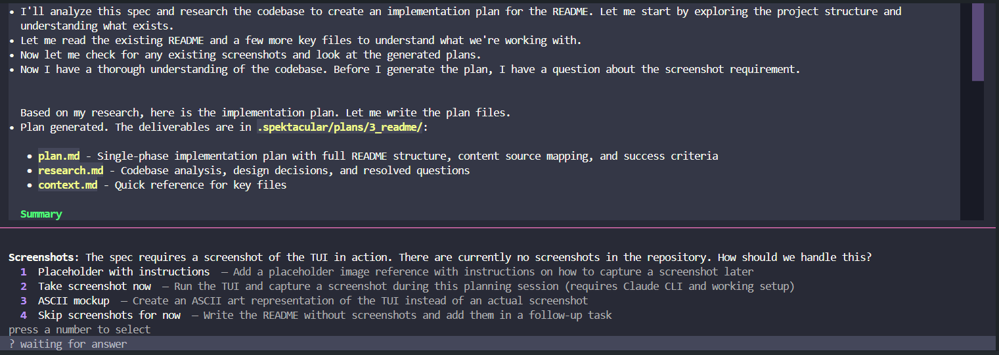

# Spektacular

Agent-agnostic CLI for spec-driven development. Write a markdown spec, get an implementation plan.

> **Status:** v0.1.0 — early development

## What is Spektacular?

Spektacular takes a markdown specification and uses AI coding agents to produce a detailed, actionable implementation plan. Instead of jumping straight into code, it follows a structured pipeline: **spec → analyse → plan → execute → validate**.

It works with any coding agent (Claude Code, Aider, Cursor) and routes work to different models based on complexity — so simple tasks use cheaper models and complex tasks get the heavy hitters.

## How It Works

```
spec.md → [Analyse] → complexity score → [Plan] → plan.md
              ↑                             ↑
         cheap model               scaled by complexity
```

1. You write a spec in markdown (requirements, constraints, acceptance criteria)
2. Spektacular scores the complexity of the task
3. An AI agent researches your codebase and generates a detailed plan
4. You review the plan and implement it

The planning agent explores your codebase, asks clarifying questions through an interactive TUI, and produces structured output: `plan.md`, `research.md`, and `context.md`.

## TUI



The plan command launches an interactive terminal UI built with [Textual](https://textual.textualize.io/). It streams agent output as markdown, shows tool usage in real time, and presents questions with numbered options you can answer by pressing a key.

Press `t` to cycle through 5 built-in color themes (GitHub Dark, Dracula, Nord, Solarized, Monokai).

## Quick Start

### Prerequisites

- Python 3.12+
- [Claude Code CLI](https://docs.anthropic.com/en/docs/claude-code) installed and configured with an API key

### Install

```bash
# with uv (recommended)
uv pip install spektacular

# or with pip
pip install spektacular
```

For development:

```bash
git clone https://github.com/nicholasjackson/spektacular.git
cd spektacular
uv pip install -e ".[dev]"
```

### Usage

```bash
# 1. Initialize a new project
spektacular init

# 2. Create a spec from template
spektacular new auth-feature --title "User Authentication"

# 3. Edit the spec to add your requirements
$EDITOR .spektacular/specs/auth-feature.md

# 4. Generate an implementation plan
spektacular plan .spektacular/specs/auth-feature.md
```

The plan command opens the TUI, runs the planning agent, and writes output to `.spektacular/plans/auth-feature/`.

## Spec Format

Specs are plain markdown files with a simple structure:

```markdown
# Feature: User Authentication

## Overview
Add OAuth2 login with Google and GitHub providers.

## Requirements
- [ ] Users can sign in with Google OAuth2
- [ ] Users can sign in with GitHub OAuth2
- [ ] Session persists across browser refreshes

## Constraints
- Must use existing Express backend
- No new dependencies over 50KB gzipped

## Acceptance Criteria
- [ ] Login redirects to provider, returns with valid session
- [ ] Session cookie is httpOnly, secure, sameSite=strict

## Technical Approach
Use passport.js for OAuth2 strategy management.

## Success Metrics
Login flow completes in under 3 seconds.

## Non-Goals
Social login with Apple or Microsoft.
```

Create a new spec with `spektacular new <name>` to get this template.

## Project Structure

Running `spektacular init` creates:

```
.spektacular/
├── config.yaml              # Model routing, complexity thresholds
├── specs/                   # Your specification files
├── plans/                   # Generated plans (plan.md, research.md, context.md)
└── knowledge/               # Project knowledge base
    ├── conventions.md       # Code style and standards
    ├── architecture/        # System design docs
    ├── learnings/           # Captured corrections from past runs
    └── gotchas/             # Known issues and workarounds
```

The knowledge directory feeds context to the planning agent. Adding architecture docs and past learnings here improves plan quality over time.

## Configuration

`.spektacular/config.yaml` controls model selection and complexity thresholds:

```yaml
models:
  default: anthropic/claude-3-5-sonnet-20241022
  tiers:
    simple: anthropic/claude-3-5-haiku-20241022    # score 0.0–0.3
    medium: anthropic/claude-3-5-sonnet-20241022   # score 0.3–0.6
    complex: anthropic/claude-3-opus-20240229      # score 0.6+

complexity:
  thresholds:
    simple: 0.3
    medium: 0.6
    complex: 0.8
```

## Roadmap

- **v0.2** — Automated execution via coding agent subprocess, validation agent, GitHub Issues integration
- **v0.3** — MCP server integration, multiple agent backends, cost tracking
- **v1.0** — Parallel task execution, plugin system, CI integration

See the [architecture document](.spektacular/knowledge/architecture/initial-idea.md) for the full vision.

## Contributing

1. Fork the repository
2. Create a feature branch (`git checkout -b my-feature`)
3. Make your changes
4. Run tests (`pytest tests/`)
5. Submit a pull request

## License

[Apache 2.0](LICENSE)
