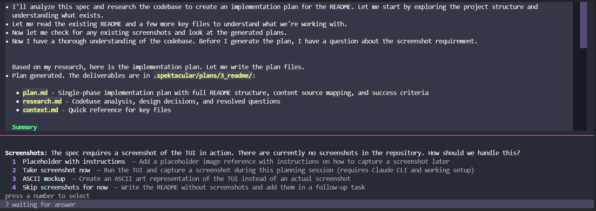

# Spektacular

Agent-agnostic CLI for spec-driven development. Write a markdown spec, get an implementation plan.

> **Status:** v0.1.0 — early development

## What is Spektacular?

Spektacular takes a markdown specification and uses AI coding agents to produce a detailed, actionable implementation plan. Instead of jumping straight into code, it follows a structured pipeline: **spec → analyse → plan → execute → validate**.

It works with any coding agent (Claude Code, Aider, Cursor) and routes work to different models based on complexity — so simple tasks use cheaper models and complex tasks get the heavy hitters.

## How It Works

```
spec.md → [Analyse] → complexity score → [Plan] → plan.md
              ↑                             ↑
         cheap model               scaled by complexity
```

1. You write a spec in markdown (requirements, constraints, acceptance criteria)
2. Spektacular scores the complexity of the task
3. An AI agent researches your codebase and generates a detailed plan
4. You review the plan and implement it

The planning agent explores your codebase, asks clarifying questions through an interactive TUI, and produces structured output: `plan.md`, `research.md`, and `context.md`.

## TUI



The plan command launches an interactive terminal UI built with [Bubble Tea](https://github.com/charmbracelet/bubbletea). It streams agent output as markdown, shows tool usage in real time, and presents questions with numbered options you can answer by pressing a key.

Press `t` to cycle through 5 built-in color themes (GitHub Dark, Dracula, Nord, Solarized, Monokai).

## Quick Start

### Prerequisites

- Go 1.21+
- [Claude Code CLI](https://docs.anthropic.com/en/docs/claude-code) installed and configured with an API key

### Install

```bash
# build from source
git clone https://github.com/nicholasjackson/spektacular.git
cd spektacular
go build -o spektacular .

# copy to PATH
cp spektacular /usr/local/bin/
```

Or download a pre-built binary from the [releases page](https://github.com/nicholasjackson/spektacular/releases).

### Usage

```bash
# 1. Initialize a new project for your agent
spektacular init claude

# 2. Create a spec from the workflow
spektacular spec new --data '{"name":"auth-feature"}'

# 3. Edit the spec_path returned by the command to add your requirements
$EDITOR .spektacular/specs/<returned-spec-name>.md

# 4. Generate an implementation plan using the returned spec_name
spektacular plan new --data '{"name":"<returned-spec-name>"}'
```

Spec names are normalized and prefixed by the CLI. Use the returned `spec_name` and `spec_path` for follow-up workflows instead of assuming the requested `name` is the final filename.

External systems can pass their own identifier as the prefix:

```bash
spektacular spec new --data '{"name":"billing-export","id":"EXT-123"}'
```

Passing `id` is accepted for timestamp and counter projects and is required when `spec.id_method` is `external`.

## Spec Format

Specs are plain markdown files with a simple structure:

```markdown
# Feature: User Authentication

## Overview
Add OAuth2 login with Google and GitHub providers.

## Requirements
- [ ] Users can sign in with Google OAuth2
- [ ] Users can sign in with GitHub OAuth2
- [ ] Session persists across browser refreshes

## Constraints
- Must use existing Express backend
- No new dependencies over 50KB gzipped

## Acceptance Criteria
- [ ] Login redirects to provider, returns with valid session
- [ ] Session cookie is httpOnly, secure, sameSite=strict

## Technical Approach
Use passport.js for OAuth2 strategy management.

## Success Metrics
Login flow completes in under 3 seconds.

## Non-Goals
Social login with Apple or Microsoft.
```

Create a new spec with `spektacular spec new --data '{"name":"auth-feature"}'` to get this template.

## Project Structure

Running `spektacular init <agent>` creates:

```
.spektacular/
├── config.yaml              # CLI command, agent, debug, and spec ID settings
├── specs/                   # Your specification files
├── plans/                   # Generated plans (plan.md, research.md, context.md)
└── knowledge/               # Project knowledge base
    ├── conventions.md       # Code style and standards
    ├── architecture/        # System design docs
    ├── learnings/           # Captured corrections from past runs
    └── gotchas/             # Known issues and workarounds
```

The knowledge directory feeds context to the planning agent. Adding architecture docs and past learnings here improves plan quality over time.

## Configuration

`.spektacular/config.yaml` controls the installed agent command and spec identifier behavior:

```yaml
command: spektacular
agent: claude
debug:
  enabled: false
spec:
  id_method: timestamp
  counter: 0
```

`spec.id_method` controls the prefix used for new spec filenames:

- `timestamp` (default): creates names like `20260509010203-billing-export`; collisions bump by one second until unused.
- `counter`: creates names like `000001-billing-export` and persists the latest value in `spec.counter`.
- `external`: requires an `id` in `spec new --data`; useful when another system owns the identifier.

Names and ids are normalized to lowercase, with accepted separators such as `.`, `@`, `-`, and internal whitespace converted to hyphens. Leading or trailing whitespace, path separators, and control characters are rejected.

## Roadmap

- **v0.2** — Automated execution via coding agent subprocess, validation agent, GitHub Issues integration
- **v0.3** — MCP server integration, multiple agent backends, cost tracking
- **v1.0** — Parallel task execution, plugin system, CI integration

See the [architecture document](.spektacular/knowledge/architecture/initial-idea.md) for the full vision.

## Testing

Spektacular uses [Harbor](https://harborframework.com/) to run end-to-end tests against
real AI coding agents inside sandboxed Docker containers.

### Prerequisites

- Docker
- [uv](https://docs.astral.sh/uv/) (Python package manager)

### Install Harbor

```bash
uv tool install harbor
```

### Run the oracle (scripted) tests

The oracle agent runs a scripted solution to validate the test harness itself —
no AI tokens required:

```bash
harbor run -p tests/harbor/spec-workflow -a oracle -o tests/harbor/jobs
```

### Run with a real agent

Harbor needs an auth token to run Claude Code inside the container. If you use
Claude Max (OAuth), export the token from your local credentials:

```bash
export ANTHROPIC_AUTH_TOKEN=$(python3 -c "import json; print(json.load(open('$HOME/.claude/.credentials.json'))['claudeAiOauth']['accessToken'])")
```

If you use an API key instead, export that:

```bash
export ANTHROPIC_API_KEY=sk-ant-...
```

Then run:

```bash
harbor run -p tests/harbor/spec-workflow -a claude-code -m claude-sonnet-4-6 -o tests/harbor/jobs
```

### Test results

Results are written to `tests/harbor/jobs/` (gitignored). Each run produces:

```
tests/harbor/jobs/<timestamp>/
├── result.json                    # Overall pass/fail and metrics
└── spec-workflow__<id>/
    ├── agent/                     # Agent output log
    ├── verifier/
    │   ├── test-stdout.txt        # pytest output
    │   └── reward.txt             # 1 = pass, 0 = fail
    └── trial.log                  # Full trial log
```

### Available test tasks

| Task | Description |
|---|---|
| `tests/harbor/spec-workflow` | Full spec creation workflow through all 10 steps |

## Building from Source

```bash
# build binary
make build

# run tests
make test

# cross-compile for all platforms
make cross
```

The `Makefile` targets:

| Target | Description |
|---|---|
| `make build` | Build `./spektacular` binary |
| `make test` | Run `go test ./...` |
| `make lint` | Run `go vet ./...` |
| `make install` | Build and copy to `$GOPATH/bin` |
| `make cross` | Build for darwin/linux/windows (amd64 + arm64) |

## Contributing

1. Fork the repository
2. Create a feature branch (`git checkout -b my-feature`)
3. Make your changes
4. Run tests (`make test`)
5. Submit a pull request

## License

[Apache 2.0](LICENSE)
